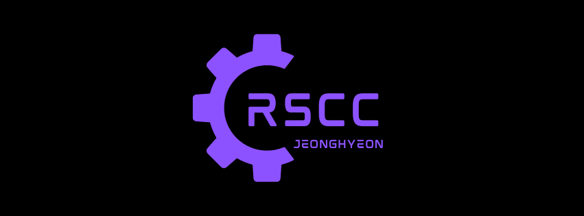

<!--
**Jeonghyeon-Ryu/Jeonghyeon-Ryu** is a ✨ _special_ ✨ repository because its `README.md` (this file) appears on your GitHub profile.

Here are some ideas to get you started:

- 🔭 I’m currently working on ...
- 🌱 I’m currently learning ...
- 👯 I’m looking to collaborate on ...
- 🤔 I’m looking for help with ...
- 💬 Ask me about ...
- 📫 How to reach me: ...
- 😄 Pronouns: ...
- ⚡ Fun fact: ...
-->

  

### Hello My World ! 👋

#
    
    
  
#

### :sparkles: Stack :sparkles:
  - UI
  
  

    
    
    
    
    
    
    
    
  

  
  - Server
  
  

    
    
    
    
  

  
  - Database
  
  

    
    
    
    
    
    
    
  

  
  - Skill
  
  

    
    
    
    
    
    
    
    
    
    
    
    
    
    
    
  

